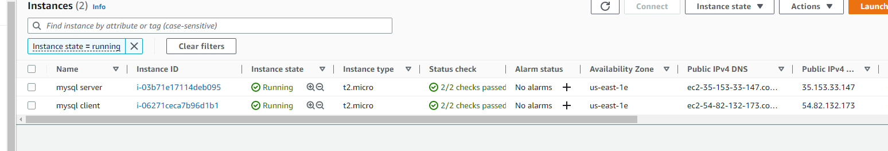
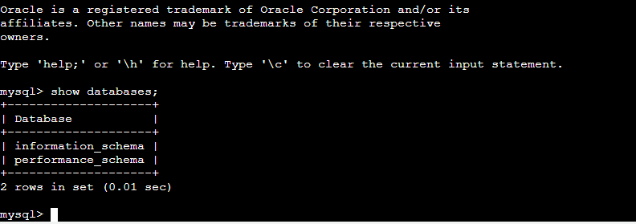

# PROJECT 5: Client/Server Architecture Using A MySQL Relational Database Management System


- Create and configure two Linux-based virtual servers (EC2 instances in AWS).
```
Server A name - `mysql server`
Server B name - `mysql client`
```
  

- On mysql server Linux Server install MySQL **Server** software.


- On mysql client Linux Server install MySQL __Client__ software.
  

By default, both EC2 virtual servers are located in the same local virtual network, so they can communicate to each other using local IP addresses. Use mysql server's local IP address to connect from mysql client. MySQL server uses TCP port 3306 by default, so you will have to open it by creating a new entry in ‘Inbound rules’ in ‘mysql server’ Security Groups. For extra security, do not allow all IP addresses to reach your ‘mysql server’ – allow access only to the specific local IP address of your ‘mysql client’.

- configure MySQL server to allow connections from remote hosts.

```
sudo vi /etc/mysql/mysql.conf.d/mysqld.cnf
```
Replace ‘127.0.0.1’ to ‘0.0.0.0’ like this:


- From mysql client Linux Server connect remotely to mysql server Database Engine without using SSH. You must use the mysql utility to perform this action.  

Step 1. create mysql user on server  


Step 2. Connect from mysql client
 


- Check that you have successfully connected to a remote MySQL server and can perform SQL queries:
```
Show databases;
```



Congratulations!